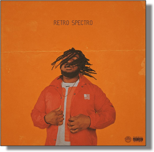
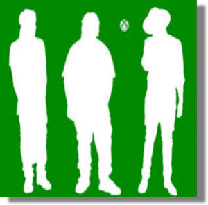
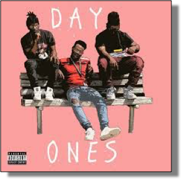
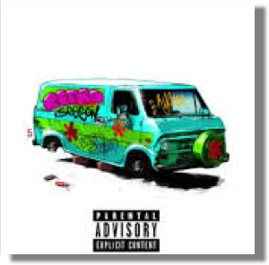
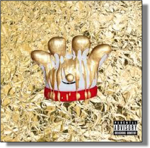
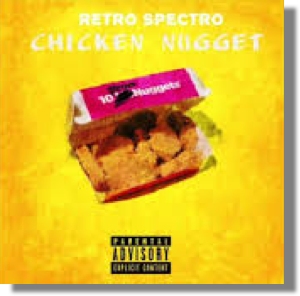

# website

<!DOCTYPE html>
<html>
<head>
	<title></title>
	<link rel="stylesheet" type="text/css" href="style.css">
	<link href="https://fonts.googleapis.com/css?family=Mali:300i,700&display=swap" rel="stylesheet">
	<link href="https://fonts.googleapis.com/css?family=Economica:700|Mali&display=swap" rel="stylesheet">
</head>
<body>
	<header>
		<a href="BIOGRAPHY">BIOGRAPHY</a>
		<a href="TOUR DATES">TOUR DATES</a>
		<a href="CONTACT">CONTACT</a>
		<ul>
			<li>
				
			</li>
			<li>
				
			</li>
			<li>
				
			</li>
			<li>
				

			</li>
		</ul>
	</header>

	<section class="intro">
		<h1>Retro Spetro</h1>
		
		
		
	</section>
 
	<section class="bio">
		<h1>Bio</h1>
		

		
YouTube star who has accumulated more than 600,000 subscribers on the platform. He also became a Vine celebrity, where he was known for his short comedic videos.He is a singer and rapper and released the single "S.T.A.N." under the named Retro Spectro on SoundCloud.

		

	</section>

	<section class="albums">

			

				
				

					<h4>life sucks when you think about it</h4>
					
life sucks when you think about it(album)-2018

				

			

			

				
				

					<h4>XBOX</h4>
					
XBOX(song)-2015

				

			

			

				
				

					<h4>Day Ones</h4>
					
 Day Ones(song)-2016

				

			

			

				
				

					<h4>S.T.A.N</h4>
					
S.T.A.N(song)-2015

				

			

			

				
				

					<h4>Hamburger Helper</h4>
					
 Hamburger helper(song)-2016

				

			

			

				
				

					<h4>Chicken Nugget</h4>
					
Chicken nugget(song)-2016

				

			

		

		
	

	</section>

	<section class="tour">
		<h1>TOUR DATES</h1>
		

			
  Nov 29, 2019  
			Beacon Theatre 

			
New york, Ny

			
		

		

			
	February 19, 2020  
			Hackensack Meridian Health Theatre 

			
California, CA

			
		

		

			
	February  27 ,2020  
			Xcite Center at Part Casino	

			
Pennsylvania, PA

			
		

		

			
	April 3, 2020  
			Peter Barclay field 

			
Utah, UT

			
		

		

			
April 19, 2020 
			The Fox Theatre	

			
Atlanta, GA

			
		

		

			
May 2, 2020 	
			Sunshine Coast Stadium 

			
North Dakota, ND

			
		

		

			
 May 15, 2020 
			HBF Stadium Mt claremont,

			
Montana, MT

			
		

		

			
May 29, 2020 
			The Chicago Theatre 

			
Chicago, IL

		

		

			
			
		

		

			
 SUBSCRIBE TO  THE NEWSLETTER

			
Follow Retro Spectro

		

		

			
			
			
			
			
			
			
		

	</section>
</body>
</html>

a{
	text-decoration: none;
	color:black;
}
{
	box-sizing: border-box;
}
body{
	margin: 0% ;
	padding: 0% ;
	background-color:black ;
}
ul{
	display:flex;
	justify-content: space-around;
}
li{
	list-style:none;

}
header {
	position: absolute;
	width: 100%;
	display: flex;
	justify-content: space-between;
	font-family:'Mali', cursive;
	font-size: 24px;
}

.intro{
	background-image:url('image.png');
	background-size: cover;
	padding: 400px 0;
	text-align: center;
}
.intro h1 {
	color: black;
	font-size: 70px;
}
.apple {
	position: absolute;
	bottom: 0;
	left:0;
}
.sound {	
	position: absolute;
	bottom: 0;
	right: 0;
}
.down {
	position: absolute;
	bottom: 0;
}
.bio {
	width: 100%;
	text-align: center;
	background-color: #D26831;
	padding: 50px 0;
}

.bio-info {
	display: flex;
	justify-content: center;
}

.bio-info p {
	background-color: #F87400;
	padding: 2%;
	width: 75%;
	font-family: 'Mali', italic;
}
.bio h1{
	font-family: 'Economica', sans-serif;
	font-size: 50px;
}

.-info {
	background-color: #F87400;

}

.albums {
	display: flex;
	flex-wrap: wrap;
	justify-content: space-around;
	background-color: #D26831;
	text-align: center;

}

.album {
	width: 30%;
}

.album-info {
	background-color: #F87400;
	font-family:'Mali', cursive;
}

.place{
	width: center;
	margin: 20px auto 0 auto;
	color:#F87400;
	text-align: center;
	display: flex;
	justify-content: space-between;
	padding: 30px;
	align-items: center;
	width: 70%;
	background-color: black
	font-family: 'Mali', italic;
}

#sub{
	text-decoration: underline;
}
.face{
		width: center;
	margin: 20px auto 0 auto;
	color:#F87400;
	text-align: center;
	display: flex;
	justify-content: space-between;
	padding: 30px;
	align-items: center;
	width: 70%;
	background-color: black
	font-family:'Mali', cursive;
	font-size: 25px;
	text-decoration: underline;
}

.tour{
	background-color: black;
}

.tour h1{
	width:100%;
	text-align: center;
	color: #F87400;
	text-decoration: underline;
	font-family: 'Economica', sans-serif;
	font-size: 72px;
}

